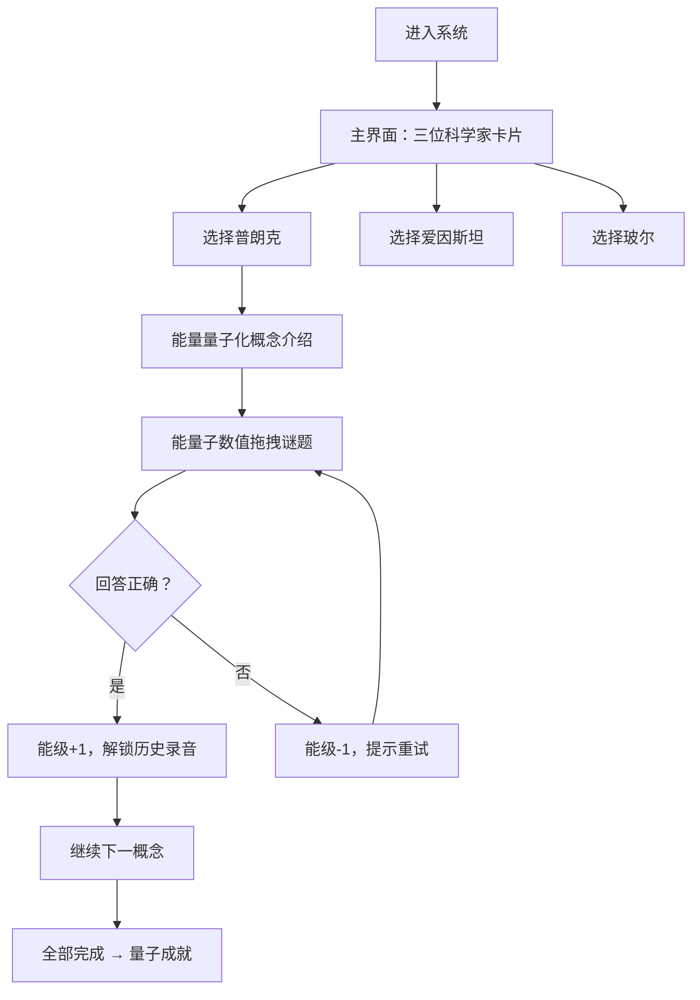

## 1. 产品概述

量子力学史话学习系统是一款以互动游戏化方式教授量子力学发展史的网页应用。通过三位核心物理学家（普朗克、爱因斯坦、玻尔）及其标志性概念（能量量子化、光量子、原子模型），玩家以解谜形式学习量子力学的诞生历程。

- 核心目标：让学习者在趣味互动中理解量子力学奠基概念与历史脉络
- 目标用户：中学生、大学低年级学生、科学爱好者
- 产品价值：将抽象物理概念转化为可交互的谜题，降低学习门槛，提升学习兴趣

## 2. 核心功能

### 2.1 功能模块

1. **首页/主界面**：能级进度条、章节选择、人物介绍
2. **谜题交互区**：拖拽式量子谜题（能量子数值拖拽、光子匹配、电子轨道拖拽）
3. **历史录音解锁**：每正确完成一题解锁一段历史文字录音
4. **能级进度系统**：右上角能级进度条，答对升级，答错降级，归零重学

### 2.2 页面详情

| 页面名称 | 模块名称 | 功能描述 |
|----------|----------|----------|
| 主界面 | 能级进度条 | 右上角显示当前量子能级，n=1到n=5，发光粒子效果 |
| 主界面 | 物理学家卡片 | 三位科学家肖像卡片，点击进入对应章节 |
| 主界面 | 章节状态指示 | 显示每章解锁/完成状态 |
| 谜题页 | 概念介绍 | 展示物理概念的历史背景和公式 |
| 谜题页 | 互动谜题 | 拖拽交互谜题，每个概念对应一种谜题类型 |
| 谜题页 | 历史录音 | 答对后解锁历史文字录音，可播放朗读 |
| 谜题页 | 反馈系统 | 答对/答错动画反馈，能级变化提示 |

## 3. 核心流程

用户进入系统 → 查看三位科学家 → 选择普朗克章节 → 学习能量量子化概念 → 完成能量子数值拖拽谜题 → 正确则能级提升、解锁历史录音 → 继续下一个概念 → 全部完成获得成就

## 4. 用户界面设计

### 4.1 设计风格

- **主色调**：深邃宇宙蓝 (#0a0e27) 为底色，配合量子蓝 (#00d4ff)、能量紫 (#9d4edd)、原子橙 (#ff6b35)
- **辅助色**：能级跃迁时的荧光绿 (#39ff14)、警告红 (#ff2e63)
- **按钮风格**：发光霓虹边框，悬停时亮度增强，圆角 8px
- **字体**：标题使用衬线字体（Lora/思源宋体），体现学术厚重感；正文使用无衬线字体；公式使用等宽字体（JetBrains Mono）
- **布局风格**：卡片式布局，深色背景配发光边框，模拟实验室仪器面板
- **视觉元素**：粒子背景、能级跃迁动画、波函数涟漪效果

### 4.2 页面设计概览

| 页面名称 | 模块名称 | UI元素 |
|----------|----------|--------|
| 主界面 | 顶部能级条 | 右上角悬浮，能级数字+发光轨道环形进度 |
| 主界面 | 科学家卡片 | 三张横向排列，肖像+姓名+贡献关键词，悬停上浮发光 |
| 主界面 | 背景 | 缓慢漂浮的量子粒子，星空质感 |
| 谜题页 | 概念区 | 左侧公式展示，右侧历史背景文字 |
| 谜题页 | 互动区 | 可拖拽元素，放置目标区域，发光提示线 |
| 谜题页 | 反馈层 | 答对时绿色粒子爆发，答错时红色抖动 |
| 谜题页 | 录音区 | 复古磁带/唱片样式播放器，文字同步高亮 |

### 4.3 响应式

- 桌面端优先设计，三栏/双栏布局
- 平板端自适应卡片排列
- 移动端单列布局，优化触控拖拽区域
- 拖拽操作支持鼠标与触摸

### 4.4 动效与微交互

- 页面入场：粒子从中心扩散，卡片依次浮现
- 拖拽中：被拖元素放大发光，目标区域脉冲提示
- 答对时：能级条向上跃迁动画，伴随粒子爆发
- 答错时：屏幕轻微红色闪烁，能级下降
- 录音播放：波形可视化动画，文字逐字高亮
