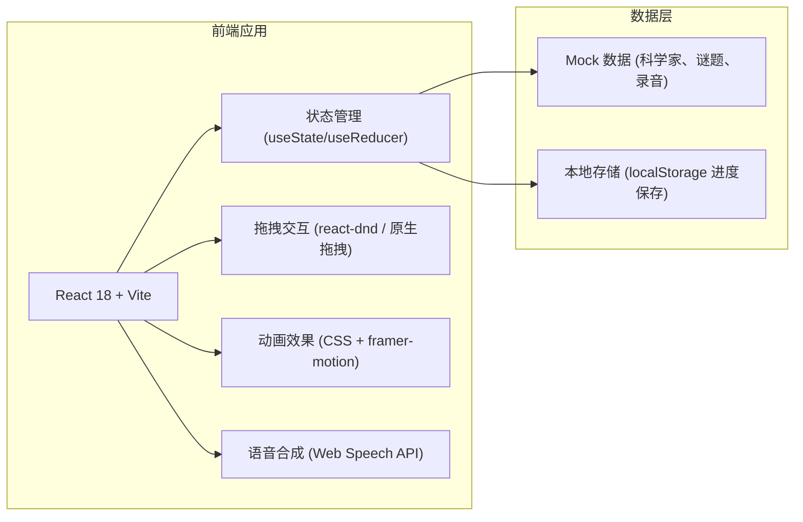

## 1. 架构设计



## 2. 技术描述

- **前端框架**：React@18 + Vite@5
- **样式方案**：Tailwind CSS@3 + 自定义 CSS 变量
- **动画库**：framer-motion@11（粒子效果、转场动画）
- **拖拽实现**：原生 HTML5 Drag and Drop API + 自定义触控支持
- **语音朗读**：Web Speech API (SpeechSynthesis)
- **状态管理**：React useState + useContext（轻量级全局状态）
- **后端**：无，纯前端应用，数据使用 Mock
- **数据持久化**：localStorage 保存学习进度

## 3. 路由定义

| 路由 | 页面 | 说明 |
|------|------|------|
| / | 首页 | 主界面，三位科学家卡片选择 |
| /puzzle/:scientistId | 谜题页 | 对应科学家的概念谜题与互动 |

使用 React Router DOM@6 进行路由管理。

## 4. 数据模型

### 4.1 科学家数据

```typescript
interface Scientist {
  id: string;
  name: string;
  nameEn: string;
  years: string;
  contribution: string;
  concept: {
    title: string;
    formula: string;
    description: string;
    history: string;
  };
  puzzle: Puzzle;
  recording: Recording;
}
```

### 4.2 谜题数据

```typescript
interface Puzzle {
  type: 'drag-number' | 'match' | 'drag-orbit';
  title: string;
  instruction: string;
  targets: PuzzleTarget[];
  options: PuzzleOption[];
}

interface PuzzleTarget {
  id: string;
  label: string;
  correctOptionId: string;
  position: { x: number; y: number };
}

interface PuzzleOption {
  id: string;
  label: string;
  value: string;
}
```

### 4.3 录音数据

```typescript
interface Recording {
  title: string;
  text: string;
  speaker: string;
  year: string;
}
```

### 4.4 游戏状态

```typescript
interface GameState {
  energyLevel: number; // 1-5 能级
  currentScientist: string | null;
  completedPuzzles: string[];
  unlockedRecordings: string[];
}
```

## 5. 组件结构

```
src/
├── components/
│   ├── layout/
│   │   ├── EnergyLevelBar.tsx    # 右上角能级进度条
│   │   └── ParticleBackground.tsx # 量子粒子背景
│   ├── home/
│   │   └── ScientistCard.tsx     # 科学家卡片
│   └── puzzle/
│       ├── ConceptIntro.tsx      # 概念介绍区
│       ├── DragNumberPuzzle.tsx  # 能量子数值拖拽谜题
│       ├── PhotonMatchPuzzle.tsx # 光量子匹配谜题
│       ├── OrbitPuzzle.tsx       # 原子轨道拖拽谜题
│       ├── RecordingPlayer.tsx   # 历史录音播放器
│       └── FeedbackOverlay.tsx   # 答对答错反馈
├── data/
│   └── scientists.ts             # 科学家与谜题 Mock 数据
├── hooks/
│   └── useGameState.ts           # 游戏状态管理
├── pages/
│   ├── Home.tsx
│   └── Puzzle.tsx
├── App.tsx
└── main.tsx
```
